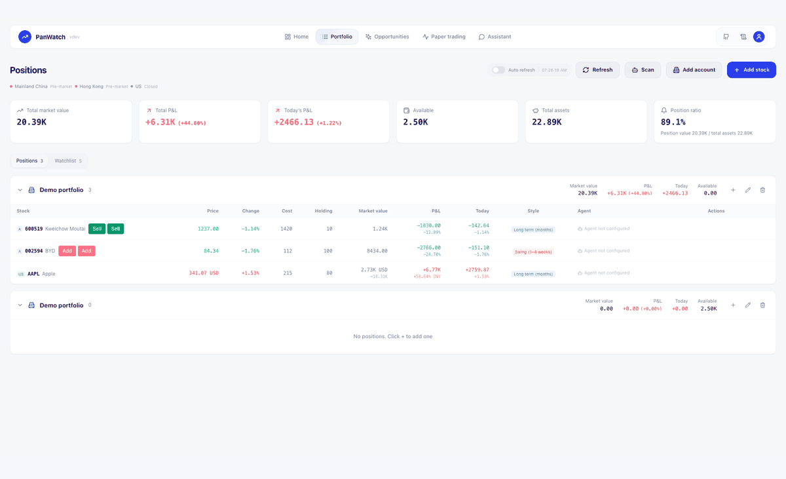
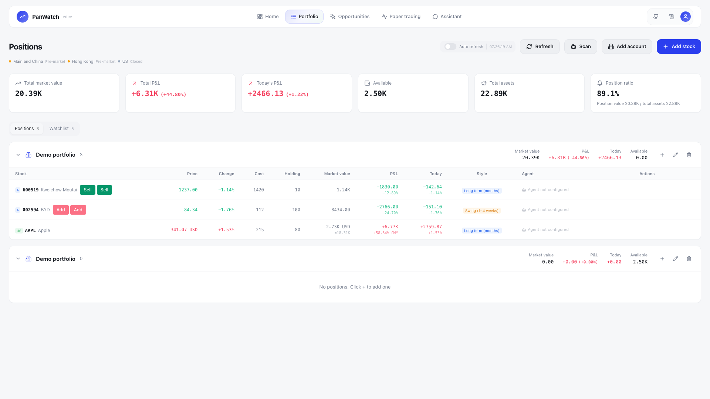
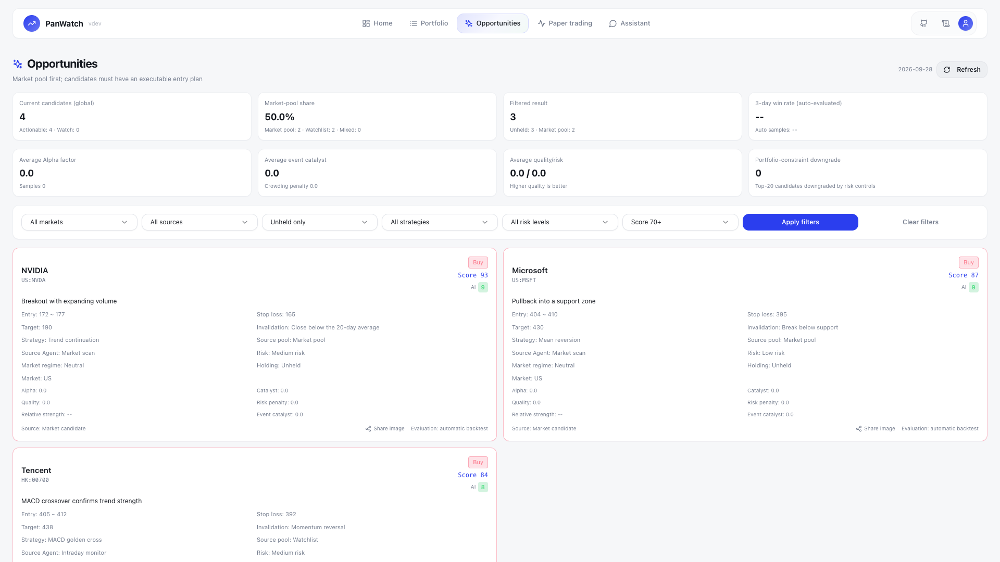
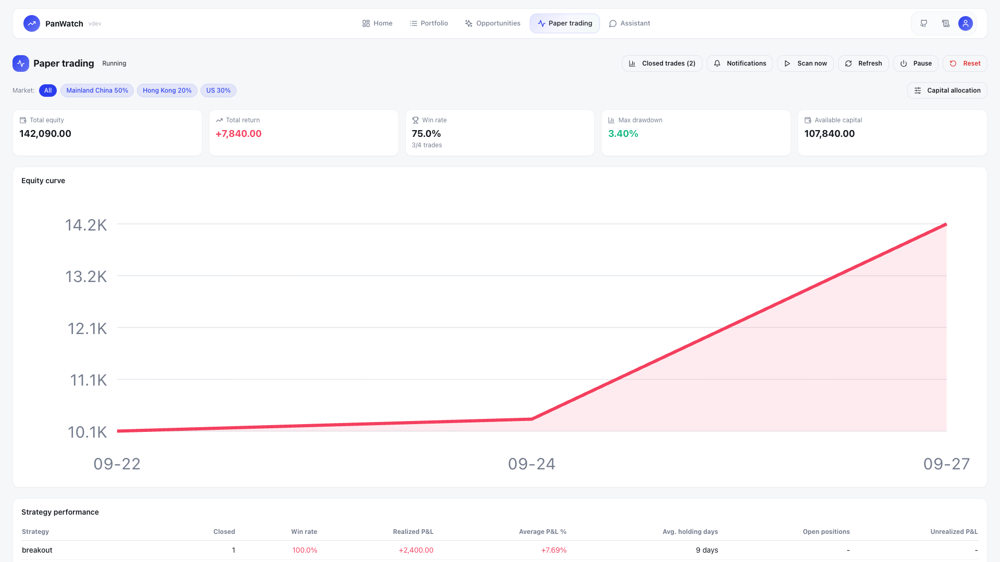
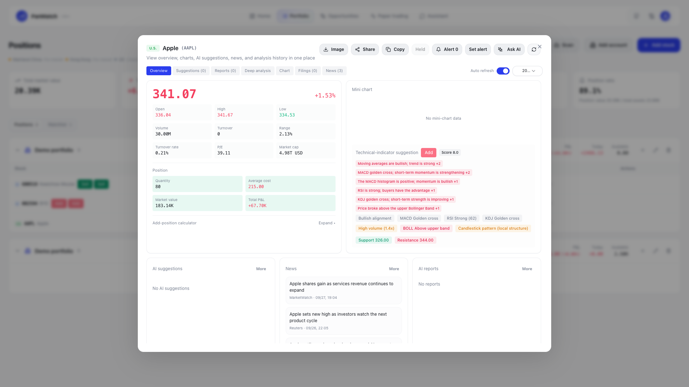
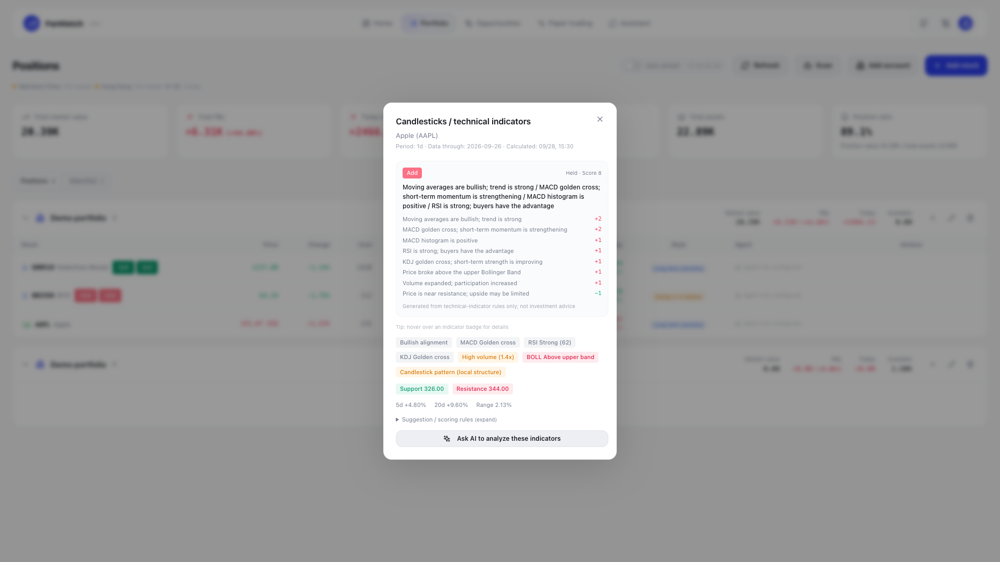
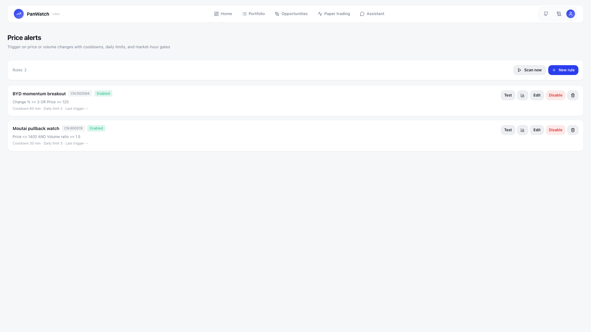
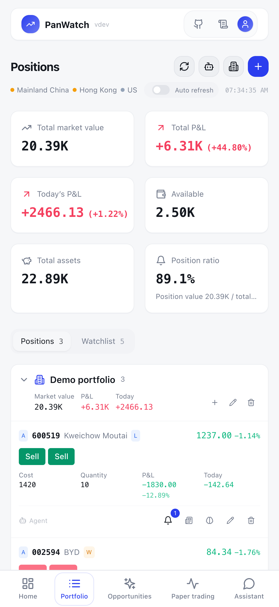
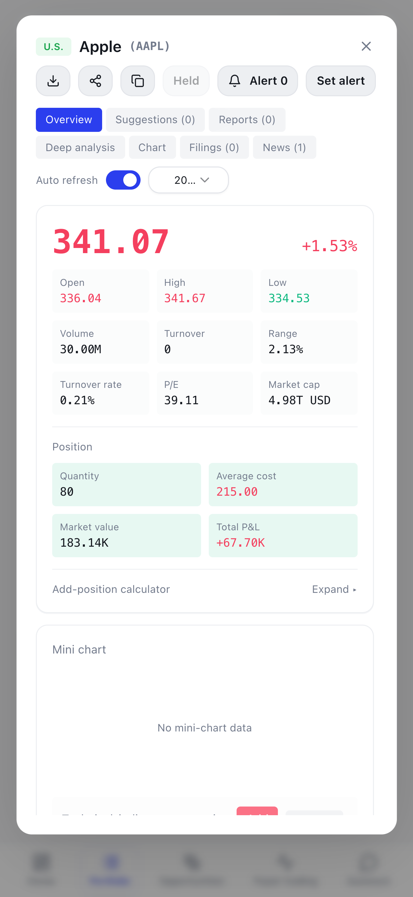
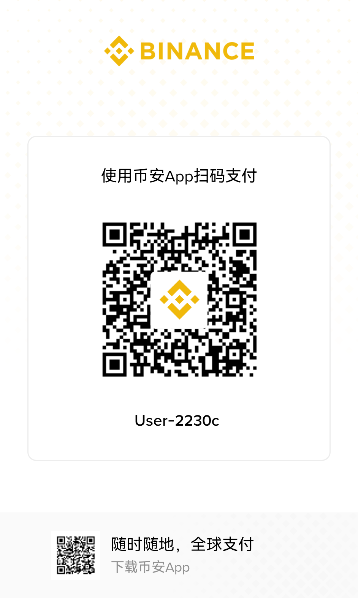

<h1 align="center">PanWatch — Self-hosted AI stock monitoring</h1>

<p align="center">
  <a href="README.md">English</a> | <a href="README.zh-CN.md">简体中文</a>
</p>

<p align="center">
  Monitor A-shares, Hong Kong, and U.S. stocks, manage your portfolios, and research ideas with <a href="https://github.com/TauricResearch/TradingAgents">TradingAgents</a>. Self-host PanWatch with your preferred OpenAI-compatible provider or local models through Ollama.
</p>

<p align="center">
  <a href="#-feature-overview">Feature overview</a> · <a href="#core-features">Core features</a> · <a href="#quick-start">Quick start</a> · <a href="#reference">Reference</a> · <a href="#support-the-project">Support</a> · <a href="#contributing">Contributing</a>
</p>

<p align="center">
  <a href="https://github.com/TNT-Likely/PanWatch/stargazers"></a>
  <a href="https://hub.docker.com/r/sunxiao0721/panwatch"></a>
  <a href="LICENSE"></a>
  <a href="https://github.com/TNT-Likely/PanWatch/commits/main"></a>
  <a href="https://github.com/TNT-Likely/PanWatch"></a>
</p>

<p align="center">
  <a href="https://www.star-history.com/tnt-likely/panwatch">
    <picture>
      <source media="(prefers-color-scheme: dark)" srcset="https://api.star-history.com/badge?repo=TNT-Likely/PanWatch&type=trending&theme=dark" />
      <source media="(prefers-color-scheme: light)" srcset="https://api.star-history.com/badge?repo=TNT-Likely/PanWatch&type=trending" />
      
    </picture>
  </a>
</p>



> 🧠 **Start from a portfolio holding → let a nine-agent TradingAgents research team analyze it → follow the bull/bear debate and risk review → receive a PM decision memo and the complete reasoning trail in your messaging app within 3–5 minutes.**

## 📸 Feature Overview

The screenshots below use the English interface; Simplified Chinese is available throughout the same product surfaces.

| Portfolio · Multi-account overview | Opportunities · AI-scored ideas |
|:---:|:---:|
|  |  |
| **Paper trading · Equity curve and performance** | **Deep stock analysis** |
|  |  |
| **Technical confluence · MACD/RSI/KDJ at a glance** | **Price alerts · Combined conditions** |
|  |  |

<details>
<summary>Mobile screenshots</summary>

 

> 📱 PanWatch is an installable PWA and can be added to your mobile home screen like a native app.

</details>

> 💡 If PanWatch is useful to you, please consider giving the project a ⭐ **Star**. It is the best way to support the project and help more people discover it.

## Core Features

| Capability | What you can do |
|---|---|
| **Portfolio** | Manage multiple brokerage accounts, track holdings and P&L, and set trading styles. |
| **AI research** | Follow technical, sentiment, news, and fundamentals analysis through debate, risk review, and a portfolio-manager decision. |
| **Scheduled agents** | Run pre-market, intraday, and closing workflows on eligible exchange trading days using your configured schedules. |
| **Price alerts** | Combine conditions with AND/OR logic and configure cooldowns, daily limits, expiration, and notification channels. |
| **Opportunities** | Review ranked candidates with entry levels, targets, and risk context. |
| **Paper trading** | Simulate signal-based entries and exits, then track equity and performance. |
| **Notifications** | Deliver reports and alerts through Telegram, WeCom, DingTalk, Feishu, Bark, or webhooks. |
| **Mobile** | Install the PWA on your home screen and use the same workspace on your phone. |

## Quick Start

```bash
docker run -d \
  --name panwatch \
  --restart unless-stopped \
  -p 8000:8000 \
  -v panwatch_data:/app/data \
  sunxiao0721/panwatch:latest
```

Open `http://localhost:8000` and create your login credentials.

<details>
<summary>Initial setup</summary>

1. Open the web interface and create your login credentials.
2. Go to **Settings → AI Services** and configure an OpenAI-compatible API, such as OpenAI, Zhipu AI, DeepSeek, or Ollama.
3. Go to **Settings → Notification Channels** and add Telegram or another delivery channel.
4. Go to **Portfolio → Add Stock**, add a symbol to your watchlist, and enable the relevant agents.

</details>

<details>
<summary>Docker Compose</summary>

```yaml
services:
  panwatch:
    image: sunxiao0721/panwatch:latest
    container_name: panwatch
    ports:
      - "8000:8000"
    volumes:
      - panwatch_data:/app/data
    restart: unless-stopped

volumes:
  panwatch_data:
```

```bash
docker compose up -d
```

</details>

<details>
<summary>First startup and browser installation</summary>

The image includes Playwright's system dependencies. Chromium's headless shell for screenshots is downloaded on first startup into the mounted volume (default `/app/data/playwright`), which requires network access and can take a few minutes.

If you do not need browser features such as screenshots, set `PLAYWRIGHT_SKIP_BROWSER_INSTALL=1` to skip this installation.

</details>

## Reference

<details>
<summary>Scheduled agents and deep analysis</summary>

| Agent | Purpose |
|---|---|
| **Pre-market outlook** | Combine overnight moves, news, and technical structure into a plan. |
| **Intraday monitor** | Watch unusual moves and technical signals during open sessions. |
| **Daily report** | Review the session and prepare the next trading day's plan. |

Schedules are configurable. Automatic runs filter exchange holidays before collection and analysis; intraday workflows also require an open trading session.

Select the brain icon beside a holding to start TradingAgents deep analysis. Four analyst roles feed a bull/bear debate, risk review, and portfolio-manager decision, with the reasoning trail available in the app and through configured notification channels. Runtime and cost depend on the selected models and configuration.

[Deep-analysis flowchart](docs/tradingagents-flow.en.md) · [Backend architecture](src/ARCHITECTURE.en.md)

</details>

<details>
<summary>Market calendars and scheduling</summary>

- Select the market status strip to compare all three exchanges across the next 14 dates. Opening/session times use your browser timezone; trade dates and status use each exchange's local date.
- A non-trading day shows closed; a completed trading day shows market closed. Beijing Saturday morning may still be New York Friday after close.
- Published 2026 closures and half-days are bundled locally. Startup warms only the previous 30 and next 90 days, without downloading full history. Unpublished weekdays show a pending calendar and block automatic execution; the bundled annual data must be updated for the next year.
- Agent Cron/interval settings remain unchanged; execution and schedule previews share calendar filters. Price alerts in “all day” mode still require a trading day.
- Paper fills require an open session for that stock's market. Paper notifications follow each exchange's local clock, including half-days and U.S. daylight-saving changes.

</details>

<details>
<summary><b>Professional technical analysis</b></summary>

- **Trend indicators:** moving-average alignment, MACD crosses, and Bollinger Band breakouts.
- **Momentum indicators:** RSI overbought/oversold conditions and KDJ saturation or divergence.
- **Price and volume:** volume-ratio anomalies, low-volume pullbacks, and high-volume breakouts.
- **Pattern recognition:** hammer, engulfing, doji, and other candlestick patterns.
- **Support and resistance:** automatic calculation of multiple support and resistance levels.

</details>

<details>
<summary><b>Price alerts</b></summary>

- Combine price, percentage change, turnover, volume ratio, and other conditions with AND/OR logic.
- Limit rules to market hours or keep them active all day on trading days; configure cooldowns, daily trigger limits, and repeat behavior.
- Set an expiration date and `HH:mm` time in the rule dialog, or leave it empty so the rule never expires.
- Choose notification channels per rule, or use the system default when none is selected.

</details>

<details>
<summary>Environment variables</summary>

| Variable | Description | Default |
|----------|-------------|---------|
| `AUTH_USERNAME` | Preconfigured login username | Set on first visit |
| `AUTH_PASSWORD` | Preconfigured login password | Set on first visit |
| `JWT_SECRET` | Secret used to sign JWTs | Generated automatically |
| `DATA_DIR` | Data storage directory | `./data` |
| `TZ` | Application timezone for Agent schedules; market-calendar times follow the browser timezone | `Asia/Shanghai` |
| `PLAYWRIGHT_SKIP_BROWSER_INSTALL` | Skip the initial Chromium installation when browser features are not required | Not set |
| `LOG_LEVEL` | Console log level. `INFO` prints business events and errors; use `DEBUG` for scheduler heartbeats, collection steps, and other diagnostics. The UI log panel always retains the complete log. | `INFO` |
| `HTTP_PROXY` / `HTTPS_PROXY` / `http_proxy` | Outbound HTTP proxy. Configure it through an external environment variable, `http_proxy=http://host:port` in `.env`, or **Settings → Global HTTP Proxy**. Priority: external environment variables > UI > `.env`. `NO_PROXY` includes `localhost,127.0.0.1` by default. | Not set |
| `OTEL_EXPORTER_OTLP_ENDPOINT` | OpenTelemetry OTLP endpoint, such as `http://jaeger:4318`. Export remains completely disabled when this is empty. The optional dependencies in `requirements-otel.txt` are also required. | Not set (disabled) |

</details>

<details>
<summary>Local development</summary>

**Requirements:** Python 3.10+ / Node.js 24.14.0 / pnpm 9.15.9

```bash
# One-command development setup (recommended)
make dev-api          # Backend with automatic venv/dependencies on :8000
make dev-web          # Frontend with automatic pnpm install on :5183

# Or start each service manually
python -m venv venv && source venv/bin/activate
pip install -r requirements.txt
python server.py                              # Backend on :8000

cd frontend && pnpm install && pnpm dev       # Frontend on :5183
```

The frontend development server runs at `http://localhost:5183` and proxies `/api` to `127.0.0.1:8000`.


[Frontend UI conventions and checks](frontend/UI_GUIDELINES.md)

</details>

<details>
<summary><b>Technology stack</b></summary>

**Backend:** FastAPI / SQLAlchemy / APScheduler / OpenAI SDK

**Frontend:** React 18 / TypeScript / Tailwind CSS / shadcn/ui

</details>

<details>
<summary><b>OpenTelemetry export (optional and disabled by default)</b></summary>

PanWatch includes a built-in observability stack with structured logs, end-to-end `trace_id` correlation, the `agent_runs` table, and node-level TradingAgents progress and cost reporting. It works without any external service.

You can optionally add standard [OpenTelemetry](https://opentelemetry.io/) export and send traces to Jaeger, Tempo, Langfuse, or another compatible APM. PanWatch maps three types of spans:

- **One agent run** → a root span correlated with the `trace_id` from `agent_runs`.
- **One LLM call** → a `gen_ai` child span following the [OpenTelemetry GenAI semantic conventions](https://opentelemetry.io/docs/specs/semconv/gen-ai/), including `gen_ai.system`, `gen_ai.request.model`, input/output token usage, and `gen_ai.operation.name`.
- **One TradingAgents node** → a child span that reuses the node-level progress callback.

Export is a complete no-op when the optional dependencies are not installed and no endpoint is configured.

Enable it in three steps:

```bash
# 1. Install the optional dependencies
pip install -r requirements-otel.txt

# 2. Configure your collector or APM endpoint
export OTEL_EXPORTER_OTLP_ENDPOINT=http://localhost:4318
export OTEL_SERVICE_NAME=panwatch   # Optional; defaults to panwatch

# 3. Start PanWatch normally. The startup log will confirm that OTel export is enabled.
python server.py
```

Run a local Jaeger instance to verify the integration:

```bash
docker run -d --name jaeger -p 16686:16686 -p 4318:4318 \
  jaegertracing/all-in-one:latest
# Trigger an agent, open http://localhost:16686, and select service=panwatch.
```

Langfuse and Tempo work the same way: point `OTEL_EXPORTER_OTLP_ENDPOINT` to their OTLP endpoint.

</details>

<details>
<summary><b>Publishing Docker images</b></summary>

The repository includes a GitHub Actions release workflow:

- Pushing a tag such as `0.2.3` automatically builds and publishes:
  - `sunxiao0721/panwatch:0.2.3`
  - `sunxiao0721/panwatch:latest`
- The workflow can also be started manually with `workflow_dispatch` and an explicit version.

Configure these repository secrets before publishing:

- `DOCKERHUB_USERNAME`
- `DOCKERHUB_TOKEN`

</details>

## Support the Project

### Sponsorship

For sponsorship or partnership inquiries, contact [sunxiaoyes@outlook.com](mailto:sunxiaoyes@outlook.com?subject=PanWatch%20sponsorship).

### Donations

PanWatch is free and open source. If it saves you time or improves your workflow, you can support continued development:

[](https://paypal.me/sunxiaoyes)

<details>
<summary>USDT (TRC20)</summary>

Address: `TKBV69B2AoU67p3vDhnJUbMJtZ1DxuUF5C`



</details>

<details>
<summary>Alipay / WeChat Pay</summary>

| Alipay | WeChat Pay |
|:---:|:---:|
|  |  |

</details>

## Contributing

Issues and pull requests are welcome. See the [contribution guide](CONTRIBUTING.md) for setup, validation, internationalization, custom agents, and market-data sources.

Community chat (Telegram): [t.me/panwatch](https://t.me/panwatch)

## License

[MIT](LICENSE)
