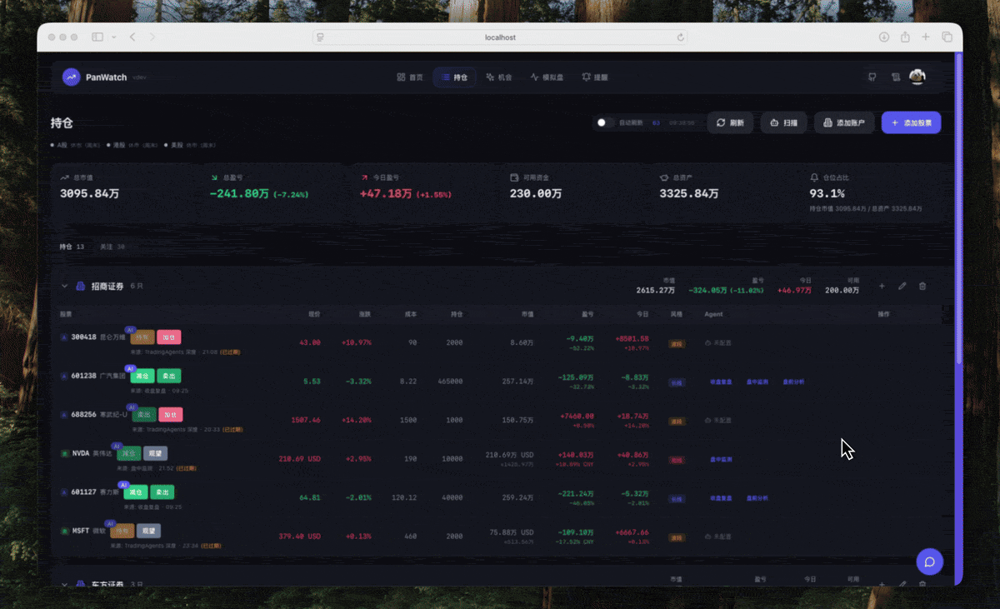
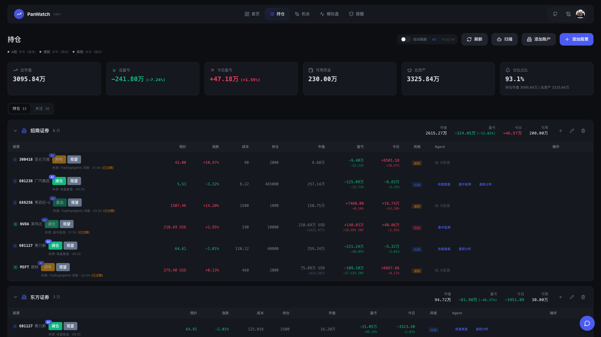
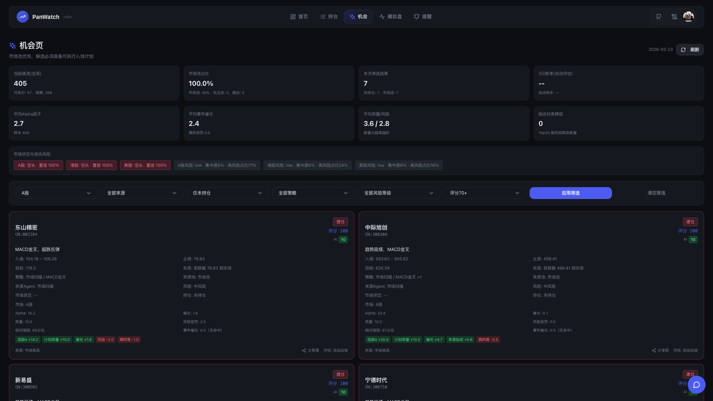
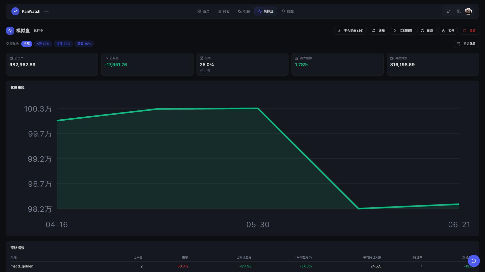
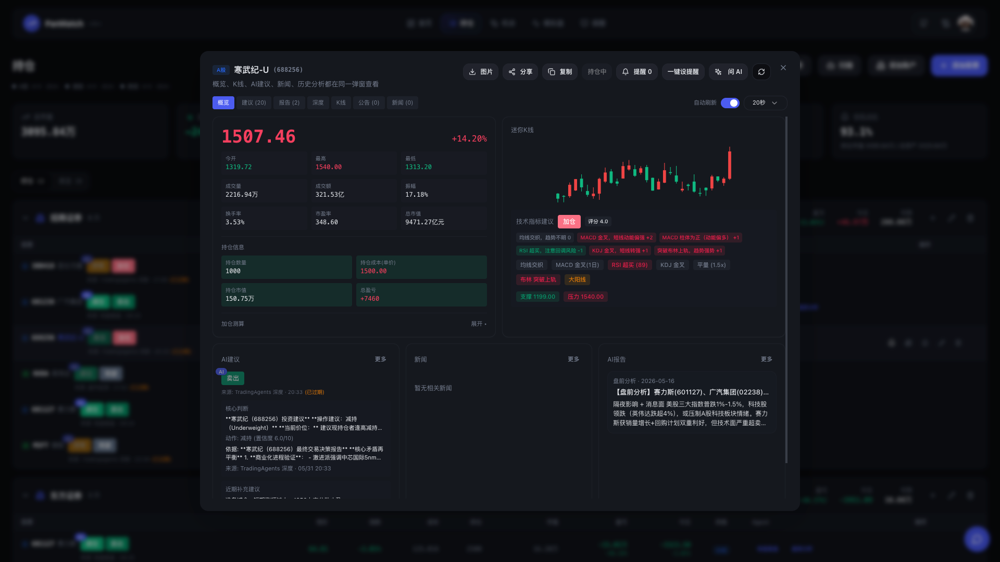
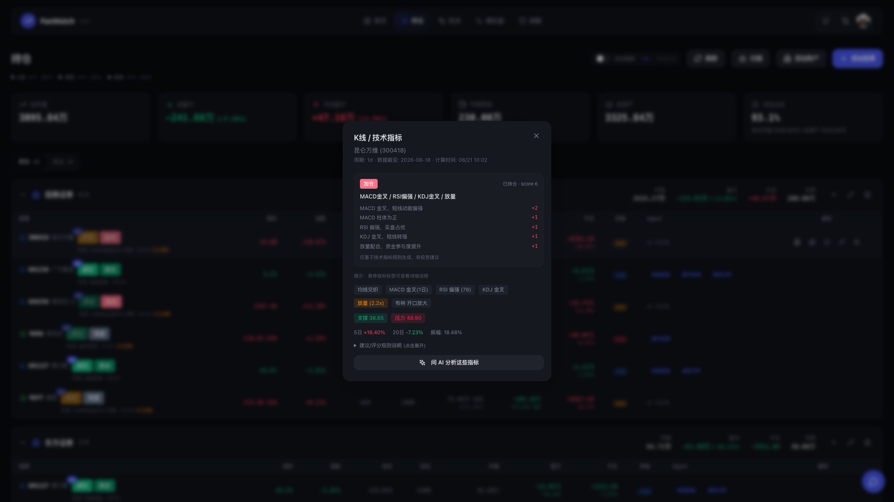
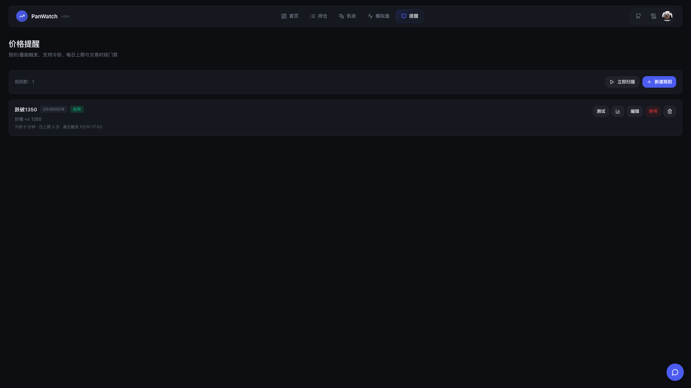
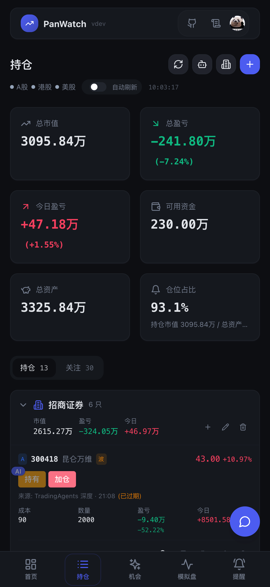
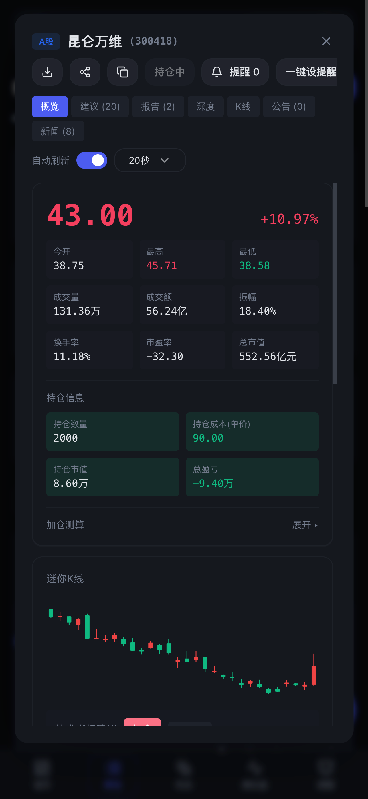

<h1 align="center">盯盘侠 PanWatch — 自托管 AI 盯盘助手</h1>

<p align="center">
  <a href="README.md">English</a> | <a href="README.zh-CN.md">简体中文</a>
</p>

<p align="center">
  管理 A 股、港股和美股持仓，监控行情与提醒，并通过 <a href="https://github.com/TauricResearch/TradingAgents">TradingAgents</a> 进行深度分析。自托管部署，可接入你选择的 OpenAI 兼容服务商或 Ollama 本地模型。
</p>

<p align="center">
  <a href="#-功能一览">功能一览</a> · <a href="#核心功能">核心功能</a> · <a href="#快速开始">快速开始</a> · <a href="#详细说明">详细说明</a> · <a href="#支持项目">支持项目</a> · <a href="#贡献">参与贡献</a>
</p>

<p align="center">
  <a href="https://github.com/TNT-Likely/PanWatch/stargazers"></a>
  <a href="https://hub.docker.com/r/sunxiao0721/panwatch"></a>
  <a href="LICENSE"></a>
  <a href="https://github.com/TNT-Likely/PanWatch/commits/main"></a>
  <a href="https://github.com/TNT-Likely/PanWatch"></a>
</p>

<p align="center">
  <a href="https://www.star-history.com/tnt-likely/panwatch">
    <picture>
      <source media="(prefers-color-scheme: dark)" srcset="https://api.star-history.com/badge?repo=TNT-Likely/PanWatch&type=trending&theme=dark" />
      <source media="(prefers-color-scheme: light)" srcset="https://api.star-history.com/badge?repo=TNT-Likely/PanWatch&type=trending" />
      
    </picture>
  </a>
</p>



> 🧠 **持仓页点一下 → TradingAgents 9-Agent 投研团队接力分析 → 看多看空辩论 → 风控审查 → PM 决策书,3-5 分钟一条完整推理链,结论直推到你的 IM。**

## 📸 功能一览

| 持仓 · 多账户汇总 | 机会页 · AI 评分选股 |
|:---:|:---:|
|  |  |
| **模拟盘 · 净值曲线 + 绩效** | **个股深度详情** |
|  |  |
| **技术指标共振 · 一眼 MACD/RSI/KDJ** | **价格提醒 · 条件组合触发** |
|  |  |

<details>
<summary>移动端截图</summary>

 

> 📱 支持 PWA，移动端可「添加到主屏幕」当原生 App 用。

</details>

> 💡 如果盯盘侠对你有帮助，点右上角 ⭐ **Star** 支持一下 —— 这是对开源项目最好的鼓励，也能让更多人发现它。

## 核心功能

| 能力 | 可以做什么 |
|---|---|
| **持仓管理** | 管理多个券商账户，查看持仓和盈亏，设置交易风格。 |
| **AI 投研** | 由技术、情绪、新闻、基本面分析进入看多看空辩论、风控审查和投资组合经理决策。 |
| **定时 Agent** | 按已配置的周期，在对应市场交易日执行盘前、盘中和盘后工作流。 |
| **价格提醒** | 用 AND / OR 组合条件，设置冷却时间、日上限、到期时间和通知渠道。 |
| **机会发现** | 查看排序后的候选及其入场位、目标价和风险信息。 |
| **模拟盘** | 模拟按信号建仓和平仓，查看净值和绩效。 |
| **消息推送** | 通过 Telegram、企业微信、钉钉、飞书、Bark 或 Webhook 接收报告和提醒。 |
| **移动端** | 将 PWA 添加到主屏幕，在手机上使用同一套工作台。 |

## 快速开始

```bash
docker run -d \
  --name panwatch \
  --restart unless-stopped \
  -p 8000:8000 \
  -v panwatch_data:/app/data \
  sunxiao0721/panwatch:latest
```

访问 `http://localhost:8000`，创建登录账号。

<details>
<summary>首次配置</summary>

1. 访问 Web 界面，设置登录账号
2. **设置 → AI 服务商**：配置 OpenAI 兼容 API（支持 OpenAI / 智谱 / DeepSeek / Ollama 等）
3. **设置 → 通知渠道**：添加 Telegram 或其他推送渠道
4. **持仓 → 添加股票**：添加自选股，启用对应 Agent

</details>

<details>
<summary>Docker Compose</summary>

```yaml
services:
  panwatch:
    image: sunxiao0721/panwatch:latest
    container_name: panwatch
    ports:
      - "8000:8000"
    volumes:
      - panwatch_data:/app/data
    restart: unless-stopped

volumes:
  panwatch_data:
```

```bash
docker compose up -d
```

</details>

<details>
<summary>首次启动与浏览器安装</summary>

镜像已包含 Playwright 的系统依赖。用于截图的 Chromium 无头浏览器会在首次启动时下载到挂载卷（默认 `/app/data/playwright`），需要网络可达，可能耗时几分钟。

不需要截图等浏览器能力时，可设置 `PLAYWRIGHT_SKIP_BROWSER_INSTALL=1` 跳过安装。

</details>

## 详细说明

<details>
<summary>定时 Agent 与深度分析</summary>

| Agent | 用途 |
|---|---|
| **盘前分析** | 综合隔夜走势、新闻和技术形态，形成操作计划。 |
| **盘中监测** | 在开市时监控行情异动与技术信号。 |
| **盘后日报** | 复盘当日交易，为下个交易日准备计划。 |

执行周期可配置。自动运行在采集和分析前过滤交易所休市日，盘中任务还需满足交易时段。

点击持仓旁的脑图标，可启动 TradingAgents 深度分析。四类分析师进入看多看空辩论、风控审查和投资组合经理决策，推理过程可在应用内查看，也可通过配置的通知渠道推送。耗时和费用取决于选择的模型与配置。

[深度分析流程图](docs/tradingagents-flow.md) · [后端架构](src/ARCHITECTURE.md)

</details>

<details>
<summary>交易日历与执行规则</summary>

- 点击市场状态栏，可对照三个市场未来 14 个日期是否交易。开盘和交易时段换算为浏览器所在时区；交易日期和当前状态按各市场当地日期判断。
- 非交易日显示休市，当日交易结束后显示已收盘。北京时间周六上午，纽约可能仍是周五收盘后。
- 应用内置 2026 年公布的休市日与半日市；启动只预热过去 30 天、未来 90 天，不请求全历史日历。未公布年份的工作日显示日历待更新，并暂停自动执行；跨年前需补充下一年度数据。
- 保留已配置的 Agent Cron / 间隔，执行与时间预览共用交易日过滤。价格提醒的“全天”也只在交易日生效。
- 模拟盘成交必须处于对应股票市场的交易时段；模拟盘通知按各交易所当地时间调度，兼容半日市与美股夏令时变化。

</details>

<details>
<summary><b>专业技术分析</b></summary>

- **趋势指标**：MA 多空排列、MACD 金叉死叉、布林带突破
- **动量指标**：RSI 超买超卖、KDJ 钝化与背离
- **量价分析**：量比异动、缩量回调、放量突破
- **形态识别**：锤子线、吞没形态、十字星等 K 线形态
- **支撑压力**：自动计算多级支撑位和压力位

</details>

<details>
<summary><b>价格提醒</b></summary>

- 支持价格、涨跌幅、成交额、量比等条件组合（AND / OR）
- 支持仅交易时段 / 交易日全天生效、冷却时间、日触发上限、重复触发模式
- 到期时间使用弹窗内日期面板 + `HH:mm` 输入，留空表示永不过期
- 可按规则选择通知渠道，不选则走系统默认渠道

</details>

<details>
<summary>环境变量</summary>

| 变量名 | 说明 | 默认值 |
|--------|------|--------|
| `AUTH_USERNAME` | 预设登录用户名 | 首次访问时设置 |
| `AUTH_PASSWORD` | 预设登录密码 | 首次访问时设置 |
| `JWT_SECRET` | JWT 签名密钥 | 自动生成 |
| `DATA_DIR` | 数据存储目录 | `./data` |
| `TZ` | Agent 调度的应用时区；交易日历时间按浏览器时区展示 | `Asia/Shanghai` |
| `PLAYWRIGHT_SKIP_BROWSER_INSTALL` | 跳过首次 Chromium 安装（不需要截图时可用） | 未设置 |
| `LOG_LEVEL` | 控制台日志级别。默认 `INFO`（只输出业务事件 + 错误）；排查问题时设 `DEBUG` 可看到调度心跳、采集过程等底层日志。UI 日志板始终保留完整记录，不受影响 | `INFO` |
| `HTTP_PROXY` / `HTTPS_PROXY` / `http_proxy` | 出站 HTTP 代理。三种配置方式任选其一: ① 启动前 `export HTTP_PROXY=...`；② `.env` 里写 `http_proxy=http://host:port`；③ UI「设置 → 全局 HTTP 代理」。三者优先级:外部环境变量 > UI > `.env`。生效后所有 httpx 客户端走代理。`NO_PROXY` 默认包含 `localhost,127.0.0.1` | 未设置 |
| `OTEL_EXPORTER_OTLP_ENDPOINT` | OpenTelemetry OTLP 导出端点(如 `http://jaeger:4318`)。**配置后**才启用 OTel trace 导出;留空则完全关闭(零副作用)。还需安装可选依赖 `requirements-otel.txt`。详见下方「OTel 导出」 | 未设置(关闭) |

</details>

<details>
<summary>本地开发</summary>

**环境要求**：Python 3.10+ / Node.js 24.14.0 / pnpm 9.15.9

```bash
# 一键开发（推荐）
make dev-api          # 启动后端（自动 venv+依赖，监听 :8000）
make dev-web          # 启动前端（自动 pnpm install，监听 :5183）

# 或手动
python -m venv venv && source venv/bin/activate
pip install -r requirements.txt
python server.py                              # 后端 :8000

cd frontend && pnpm install && pnpm dev       # 前端 :5183
```

前端 dev server 跑在 `http://localhost:5183`，并把 `/api` 代理到 `127.0.0.1:8000`。

[前端 UI 约定与检查](frontend/UI_GUIDELINES.zh-CN.md)

</details>

<details>
<summary><b>技术栈</b></summary>

**后端**：FastAPI / SQLAlchemy / APScheduler / OpenAI SDK

**前端**：React 18 / TypeScript / Tailwind CSS / shadcn/ui

</details>

<details>
<summary><b>OTel 导出（可选，默认关闭）</b></summary>

PanWatch 内建一套自建可观测体系(结构化日志 `trace_id` 贯穿 / `agent_runs` 运行表 / TradingAgents 节点级进度与成本),开箱即用、无需任何外部组件。

在此之上,可**可选地**再挂一层标准 [OpenTelemetry](https://opentelemetry.io/) 导出,把 trace 送到 Jaeger / Tempo / Langfuse 等标准 APM。三类 span 映射:

- **Agent 一次运行** → root span(复用 `agent_runs` 的 `trace_id` 关联)
- **单次 LLM 调用** → `gen_ai` 子 span,遵循 [OpenTelemetry GenAI 语义约定](https://opentelemetry.io/docs/specs/semconv/gen-ai/)(`gen_ai.system` / `gen_ai.request.model` / `gen_ai.usage.input_tokens` / `gen_ai.usage.output_tokens` / `gen_ai.operation.name`),可被标准 APM 识别为一次模型调用
- **TradingAgents 节点** → 子 span(复用节点级进度回调)

**默认完全关闭**:不装依赖、不配 endpoint 时,导出层全程 no-op,不改变任何现有行为。

**开启三步**:

```bash
# 1. 安装可选依赖
pip install -r requirements-otel.txt

# 2. 配置 OTLP 端点(指向你的 collector / APM)
export OTEL_EXPORTER_OTLP_ENDPOINT=http://localhost:4318
export OTEL_SERVICE_NAME=panwatch   # 可选,默认 panwatch

# 3. 正常启动;启动日志出现 "OTel 导出已启用" 即生效
python server.py
```

**本地起一个 Jaeger 验证**:

```bash
docker run -d --name jaeger -p 16686:16686 -p 4318:4318 \
  jaegertracing/all-in-one:latest
# 触发任意 Agent 运行后,打开 http://localhost:16686 选 service=panwatch 查看 trace
```

Langfuse / Tempo 同理,把 `OTEL_EXPORTER_OTLP_ENDPOINT` 指向对应 OTLP 入口即可。

</details>

<details>
<summary><b>发布（Docker 镜像）</b></summary>

本项目内置 GitHub Actions 发布流程：

- 打 tag（例如 `0.2.3`）会自动构建并推送 Docker 镜像
  - `sunxiao0721/panwatch:0.2.3`
  - `sunxiao0721/panwatch:latest`
- 也支持在 GitHub Actions 里手动触发（workflow_dispatch）指定版本号

需要在仓库 Secrets 中配置：

- `DOCKERHUB_USERNAME`
- `DOCKERHUB_TOKEN`

</details>

## 支持项目

### 赞助合作

欢迎品牌赞助与合作，点击 [sunxiaoyes@outlook.com](mailto:sunxiaoyes@outlook.com?subject=PanWatch%20sponsorship) 联系。

### 个人捐赠

PanWatch 完全免费开源。如果它节省了你的时间或改善了工作流，欢迎支持项目持续开发：

[](https://paypal.me/sunxiaoyes)

<details>
<summary>USDT（TRC20）</summary>

地址：`TKBV69B2AoU67p3vDhnJUbMJtZ1DxuUF5C`


</details>

<details>
<summary>支付宝 / 微信支付</summary>

| 支付宝 | 微信支付 |
|:---:|:---:|
|  |  |

</details>

## 贡献

欢迎提交 Issue 和 PR！环境配置、验证、多语言、自定义 Agent 和数据源开发请参考[贡献指南](CONTRIBUTING.zh-CN.md)。
社区交流（Telegram）：[t.me/panwatch](https://t.me/panwatch)

## License

[MIT](LICENSE)
