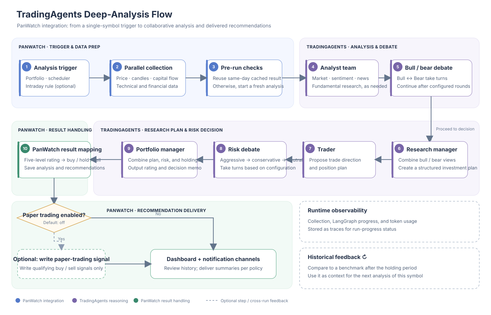

# TradingAgents Deep-Analysis Flow

[简体中文](tradingagents-flow.md)

PanWatch can trigger a single-symbol analysis from the portfolio page, a scheduled agent, or an enabled intraday-event rule. The flow combines PanWatch data preparation and result handling with TradingAgents' multi-agent decision process.

The number of research-debate and risk-discussion rounds is configurable. Paper-trading integration is disabled by default; when enabled, only qualifying buy or sell recommendations are written as paper-trading signals. TradingAgents ratings are mapped to PanWatch buy, hold, or sell recommendations. Ratings that cannot be parsed are marked for human review.

TradingAgents stores its decision log separately. Once the holding period ends and market data is available, relative benchmark performance and reflection notes can inform a later analysis of the same symbol. PanWatch analysis history and the recommendation pool display results but are stored separately from the upstream decision log.

## Related implementation

- [TradingAgentsAgent: collection, caching, and upstream graph invocation](../src/modules/automation/tradingagents/agent.py)
- [PanWatch data context and portfolio conversion](../src/modules/automation/tradingagents/data_context.py)
- [PanWatch market-data tool adapters](../src/modules/automation/tradingagents/toolkit_adapter.py)
- [Decision-rating mapping and paper-trading signal bridge](../src/modules/automation/tradingagents/decision.py)
- [Upstream TradingAgents multi-agent flow (the version currently used by PanWatch is v0.5.0)](https://github.com/TauricResearch/TradingAgents/blob/v0.5.0/tradingagents/graph/setup.py)
